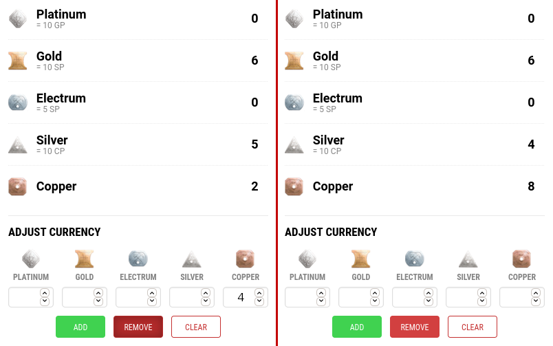

#  Better DND Beyond Currency

**Better DND Beyond Currency** is an add-on based on the new WebExtensions technology
and targeted to *Firefox* and *Chrome* based browsers.

This extension adjusts how currency is calculated on DND Beyond
so that coins of higher value will be changed into lower value coins
when you remove more of the lower value coin than you have.

## Contributing

### Running the tests

There are none...yet

### Code Style

Whatever is readable...for now

## Versioning

We use [SemVer](http://semver.org/) for versioning. For the versions available, see the [tags on this repository](https://github.com/AWhetter/better_dnd_beyond_currency/tags).

## License

This project is licensed under the BSD-3-Clause License.
See the [LICENSE.md](LICENSE.md) file for details.

This extension uses the following third party scripts:

-   [WebExtension browser API Polyfill](https://github.com/mozilla/webextension-polyfill)
    | Copyright by Mozilla
    | [MPL-2.0](https://github.com/mozilla/webextension-polyfill/blob/master/LICENSE)
